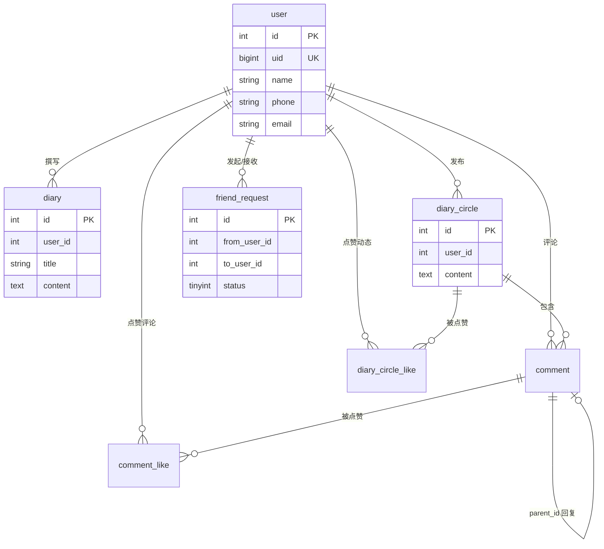

# SmartDiary 数据库设计文档

## 1. 概述

| 项目 | 说明 |
|------|------|
| 数据库名 | `smartdiary` |
| DBMS | MySQL 8.0+ |
| 字符集 | `utf8mb4` |
| 存储引擎 | InnoDB |
| 全量脚本 | `back/src/main/resources/smartdiary.sql` |
| 增量脚本 | `back/src/main/resources/db/*.sql` |

本库为智能日记 Web 应用提供持久化，涵盖用户账号、私人日记、字迹圈（社交动态）、评论互动与好友关系。表之间**未声明外键约束**，关联由应用层保证；删除用户时需业务侧级联处理相关数据。

---

## 2. 逻辑 ER 关系



**好友关系说明**：无独立 `friend` 表。双向好友通过 `friend_request` 中 `status = 1`（已同意）的记录表示；列表查询在应用层按 `from_user_id` / `to_user_id` 与当前用户匹配。

---

## 3. 表清单

| 序号 | 表名 | 中文名 | 说明 |
|------|------|--------|------|
| 1 | `user` | 用户表 | 账号、资料、隐私与主题 |
| 2 | `diary` | 日记表 | 用户私人日记 |
| 3 | `diary_circle` | 字迹圈动态表 | 广场/圈子动态 |
| 4 | `diary_circle_like` | 动态点赞表 | 用户对动态的点赞 |
| 5 | `comment` | 评论表 | 动态下的评论与回复 |
| 6 | `comment_like` | 评论点赞表 | 用户对评论的点赞 |
| 7 | `friend_request` | 好友申请表 | 申请、同意、拒绝及好友关系载体 |

---

## 4. 表结构明细（论文表格格式）

> **复制到 Word**  
> - 推荐：打开同目录 [`数据库表结构-Word粘贴.txt`](./数据库表结构-Word粘贴.txt)，全选复制后粘贴。  
> - 或：展开各表下方「Tab 分隔文本」，复制代码块内容。  
> - 若未自动成表：选中粘贴内容 → **插入 → 表格 → 文本转换成表格**，分隔符选 **制表符**。  
> **列说明**：「是否不是 null」填 **是** 表示 `NOT NULL`，填 **否** 表示允许为空；「长度」对 `text`/`datetime` 等无固定长度类型记 **—**。

### 4.1 user 用户信息表

**表 4.1 user 用户信息表**

| 名称 | 类型 | 长度 | 是否不是 null | 是否为键 | 注释 |
|------|------|------|---------------|----------|------|
| id | int | — | 是 | 主键 | 用户 ID，自增 |
| uid | bigint | 8 | 是 | 唯一 | 账号 UID，从 10000000 起 |
| name | varchar | 255 | 是 | 否 | 昵称（登录名） |
| password | varchar | 255 | 是 | 否 | 密码 MD5 摘要 |
| phone | varchar | 100 | 是 | 否 | 手机号 |
| email | varchar | 255 | 否 | 否 | 邮箱，可选 |
| allow_phone_search | tinyint | 1 | 是 | 否 | 是否允许手机号被搜索，默认 1 |
| allow_email_search | tinyint | 1 | 是 | 否 | 是否允许邮箱被搜索，默认 1 |
| hide_phone | tinyint | 1 | 是 | 否 | 对好友隐藏手机号，默认 0 |
| hide_email | tinyint | 1 | 是 | 否 | 对好友隐藏邮箱，默认 0 |
| birthday | date | — | 否 | 否 | 生日 |
| address | varchar | 255 | 否 | 否 | 地址（可为省市区编码） |
| avatar | longtext | — | 否 | 否 | 头像（常为 Base64） |
| theme | varchar | 50 | 否 | 否 | 界面主题，默认 default |

<details>
<summary>Tab 分隔文本（点击展开复制）</summary>

```
表 4.1 user 用户信息表
名称	类型	长度	是否不是 null	是否为键	注释
id	int	—	是	主键	用户 ID，自增
uid	bigint	8	是	唯一	账号 UID，从 10000000 起
name	varchar	255	是	否	昵称（登录名）
password	varchar	255	是	否	密码 MD5 摘要
phone	varchar	100	是	否	手机号
email	varchar	255	否	否	邮箱，可选
allow_phone_search	tinyint	1	是	否	是否允许手机号被搜索，默认 1
allow_email_search	tinyint	1	是	否	是否允许邮箱被搜索，默认 1
hide_phone	tinyint	1	是	否	对好友隐藏手机号，默认 0
hide_email	tinyint	1	是	否	对好友隐藏邮箱，默认 0
birthday	date	—	否	否	生日
address	varchar	255	否	否	地址（可为省市区编码）
avatar	longtext	—	否	否	头像（常为 Base64）
theme	varchar	50	否	否	界面主题，默认 default
```

</details>

索引：`PRIMARY(id)`；`uk_user_uid(uid)` 唯一。

---

### 4.2 diary 日记表

**表 4.2 diary 日记表**

| 名称 | 类型 | 长度 | 是否不是 null | 是否为键 | 注释 |
|------|------|------|---------------|----------|------|
| id | int | — | 是 | 主键 | 日记 ID，自增 |
| user_id | int | — | 是 | 否 | 所属用户 ID |
| title | varchar | 255 | 是 | 否 | 标题 |
| content | text | — | 否 | 否 | 正文（富文本 HTML） |
| create_time | datetime | — | 是 | 否 | 创建时间 |
| update_time | datetime | — | 是 | 否 | 更新时间 |

<details>
<summary>Tab 分隔文本（点击展开复制）</summary>

```
表 4.2 diary 日记表
名称	类型	长度	是否不是 null	是否为键	注释
id	int	—	是	主键	日记 ID，自增
user_id	int	—	是	否	所属用户 ID
title	varchar	255	是	否	标题
content	text	—	否	否	正文（富文本 HTML）
create_time	datetime	—	是	否	创建时间
update_time	datetime	—	是	否	更新时间
```

</details>

索引：`PRIMARY(id)`；`idx_user_id(user_id)`；`idx_create_time(create_time)`。

---

### 4.3 diary_circle 字迹圈动态表

**表 4.3 diary_circle 字迹圈动态表**

| 名称 | 类型 | 长度 | 是否不是 null | 是否为键 | 注释 |
|------|------|------|---------------|----------|------|
| id | int | — | 是 | 主键 | 动态 ID，自增 |
| user_id | int | — | 是 | 否 | 发布用户 ID |
| content | text | — | 是 | 否 | 动态正文 |
| create_time | datetime | — | 否 | 否 | 创建时间 |
| update_time | datetime | — | 否 | 否 | 更新时间 |

**统计字段（非表列）**：API 返回的 `likeCount`、`commentCount` 由 `diary_circle_like`、`comment` 表 `COUNT` 子查询实时计算。

<details>
<summary>Tab 分隔文本（点击展开复制）</summary>

```
表 4.3 diary_circle 字迹圈动态表
名称	类型	长度	是否不是 null	是否为键	注释
id	int	—	是	主键	动态 ID，自增
user_id	int	—	是	否	发布用户 ID
content	text	—	是	否	动态正文
create_time	datetime	—	否	否	创建时间
update_time	datetime	—	否	否	更新时间
```

</details>

索引：`PRIMARY(id)`；`idx_user_id(user_id)`；`idx_create_time(create_time)`。

---

### 4.4 diary_circle_like 动态点赞记录表

**表 4.4 diary_circle_like 动态点赞记录表**

| 名称 | 类型 | 长度 | 是否不是 null | 是否为键 | 注释 |
|------|------|------|---------------|----------|------|
| id | int | — | 是 | 主键 | 记录 ID，自增 |
| diary_circle_id | int | — | 是 | 否 | 动态 ID |
| user_id | int | — | 是 | 否 | 点赞用户 ID |
| create_time | datetime | — | 否 | 否 | 点赞时间 |

<details>
<summary>Tab 分隔文本（点击展开复制）</summary>

```
表 4.4 diary_circle_like 动态点赞记录表
名称	类型	长度	是否不是 null	是否为键	注释
id	int	—	是	主键	记录 ID，自增
diary_circle_id	int	—	是	否	动态 ID
user_id	int	—	是	否	点赞用户 ID
create_time	datetime	—	否	否	点赞时间
```

</details>

索引：`PRIMARY(id)`；`uk_diary_circle_user(diary_circle_id, user_id)` 唯一；`idx_diary_circle_id`；`idx_user_id`。

---

### 4.5 comment 评论表

**表 4.5 comment 评论表**

| 名称 | 类型 | 长度 | 是否不是 null | 是否为键 | 注释 |
|------|------|------|---------------|----------|------|
| id | int | — | 是 | 主键 | 评论 ID，自增 |
| circle_id | int | — | 是 | 否 | 所属动态 ID |
| user_id | int | — | 是 | 否 | 评论用户 ID |
| content | text | — | 是 | 否 | 评论内容 |
| parent_id | int | — | 否 | 否 | 父评论 ID，NULL 为顶级 |
| create_time | datetime | — | 否 | 否 | 创建时间 |
| update_time | datetime | — | 否 | 否 | 更新时间 |

**统计字段（非表列）**：API 返回的 `likeCount` 由 `comment_like` 表 `COUNT` 子查询实时计算。

<details>
<summary>Tab 分隔文本（点击展开复制）</summary>

```
表 4.5 comment 评论表
名称	类型	长度	是否不是 null	是否为键	注释
id	int	—	是	主键	评论 ID，自增
circle_id	int	—	是	否	所属动态 ID
user_id	int	—	是	否	评论用户 ID
content	text	—	是	否	评论内容
parent_id	int	—	否	否	父评论 ID，NULL 为顶级
create_time	datetime	—	否	否	创建时间
update_time	datetime	—	否	否	更新时间
```

</details>

索引：`PRIMARY(id)`；`idx_circle_id`；`idx_user_id`；`idx_parent_id`。

---

### 4.6 comment_like 评论点赞记录表

**表 4.6 comment_like 评论点赞记录表**

| 名称 | 类型 | 长度 | 是否不是 null | 是否为键 | 注释 |
|------|------|------|---------------|----------|------|
| id | int | — | 是 | 主键 | 记录 ID，自增 |
| comment_id | int | — | 是 | 否 | 评论 ID |
| user_id | int | — | 是 | 否 | 点赞用户 ID |
| create_time | datetime | — | 否 | 否 | 点赞时间 |

<details>
<summary>Tab 分隔文本（点击展开复制）</summary>

```
表 4.6 comment_like 评论点赞记录表
名称	类型	长度	是否不是 null	是否为键	注释
id	int	—	是	主键	记录 ID，自增
comment_id	int	—	是	否	评论 ID
user_id	int	—	是	否	点赞用户 ID
create_time	datetime	—	否	否	点赞时间
```

</details>

索引：`PRIMARY(id)`；`uk_comment_user(comment_id, user_id)` 唯一；`idx_comment_id`；`idx_user_id`。

---

### 4.7 friend_request 好友申请表

**表 4.7 friend_request 好友申请表**

| 名称 | 类型 | 长度 | 是否不是 null | 是否为键 | 注释 |
|------|------|------|---------------|----------|------|
| id | int | — | 是 | 主键 | 主键，自增 |
| from_user_id | int | — | 是 | 否 | 申请人用户 ID |
| to_user_id | int | — | 是 | 否 | 被申请人用户 ID |
| status | tinyint | — | 是 | 否 | 0 待处理 1 已同意 2 已拒绝 |
| create_time | datetime | — | 否 | 否 | 创建时间 |
| update_time | datetime | — | 否 | 否 | 更新时间 |

<details>
<summary>Tab 分隔文本（点击展开复制）</summary>

```
表 4.7 friend_request 好友申请表
名称	类型	长度	是否不是 null	是否为键	注释
id	int	—	是	主键	主键，自增
from_user_id	int	—	是	否	申请人用户 ID
to_user_id	int	—	是	否	被申请人用户 ID
status	tinyint	—	是	否	0 待处理 1 已同意 2 已拒绝
create_time	datetime	—	否	否	创建时间
update_time	datetime	—	否	否	更新时间
```

</details>

索引：`PRIMARY(id)`；`uk_from_to(from_user_id, to_user_id)` 唯一；`idx_to_status`；`idx_from_status`。好友关系由 `status = 1` 表示。

---

## 5. 模块与表映射

| 功能模块 | 主要表 |
|----------|--------|
| 注册 / 登录 / 个人资料 | `user` |
| 隐私与搜索 | `user`（`allow_*`、`hide_*`） |
| 私人日记 CRUD | `diary` |
| 字迹圈 Feed | `diary_circle`、`diary_circle_like` |
| 评论与回复 | `comment`、`comment_like` |
| 好友搜索 / 申请 / 列表 | `user`、`friend_request` |

---

## 6. 搜索与隐私（数据层视角）

| 搜索方式 | 匹配字段 | 库表条件 | 用户开关 |
|----------|----------|----------|----------|
| UID | `user.uid` | 精确匹配数字 UID | 无（始终允许） |
| 邮箱 | `user.email` | `email = ?` | `allow_email_search = 1` |
| 手机号 | `user.phone` | `phone = ?`（通常 11 位） | `allow_phone_search = 1` |

好友资料展示时，根据 `hide_phone`、`hide_email` 在应用层置空对应字段后返回。

---

## 7. 点赞/评论数统计

原 `diary_circle.like_count`、`diary_circle.comment_count`、`comment.like_count` 已移除，避免与 `*_like` / `comment` 明细表双写不一致。

| 展示字段 | 数据来源 |
|----------|----------|
| 动态点赞数 | `COUNT(*)` from `diary_circle_like` |
| 动态评论数 | `COUNT(*)` from `comment` where `circle_id` |
| 评论点赞数 | `COUNT(*)` from `comment_like` |

删除动态时会级联清理该动态下的评论、评论点赞与动态点赞记录。

---

## 8. 数据库升级路径

适用于**已有旧库**、不便全量重导的场景，按顺序执行：

| 顺序 | 脚本 | 说明 |
|------|------|------|
| 1 | `db/user_uid_email.sql` | 增加 `uid`、`email` 及回填 |
| 2 | `db/user_privacy.sql` | 增加 `allow_phone_search`、`hide_phone`、`hide_email` |
| 3 | `db/user_allow_email_search.sql` | 增加 `allow_email_search` |
| 4 | `db/drop_redundant_counts.sql` | 删除冗余计数字段 |
| — | `db/friend_request_only.sql` | 仅缺好友表时单独建表 |

**全新环境**：直接执行 `smartdiary.sql` 即可，已包含上述全部字段。

---

## 9. 演示数据说明

`smartdiary.sql` 内置部分演示数据：

- 用户 id `2`–`5`，密码均为 **123456**（MD5：`e10adc3949ba59abbe56e057f20f883e`）。
- 演示用户 `avatar` 为 `NULL`，避免脚本体积过大。
- 部分 `diary` 记录含 HTML/Base64 图片，仅作开发测试用。

---

## 10. 设计说明与建议

1. **无外键**：便于 Navicat 导入与历史数据迁移；生产环境若需强一致，可增加 `ON DELETE CASCADE` 外键或定时清理任务。
2. **密码**：当前为 MD5，生产建议升级为 bcrypt 等并加盐。
3. **大字段**：`user.avatar`、`diary.content` 可能很大，长期建议头像改为对象存储 URL，日记图片独立附件表。
4. **好友模型**：好友即 `friend_request.status = 1`；若好友量增大，可考虑拆出 `friend` 关系表并保留 `friend_request` 仅作申请流水。

---

## 11. 文档版本

| 版本 | 日期 | 说明 |
|------|------|------|
| 1.0 | 2026-05-19 | 初版，对齐 `smartdiary.sql` 及 UID/邮箱/隐私字段 |
| 1.1 | 2026-05-26 | 第 4 章改为论文六列表格格式，另附 Word 粘贴用文本 |
| 1.2 | 2026-05-26 | 移除冗余计数字段，改由 COUNT 子查询统计 |
